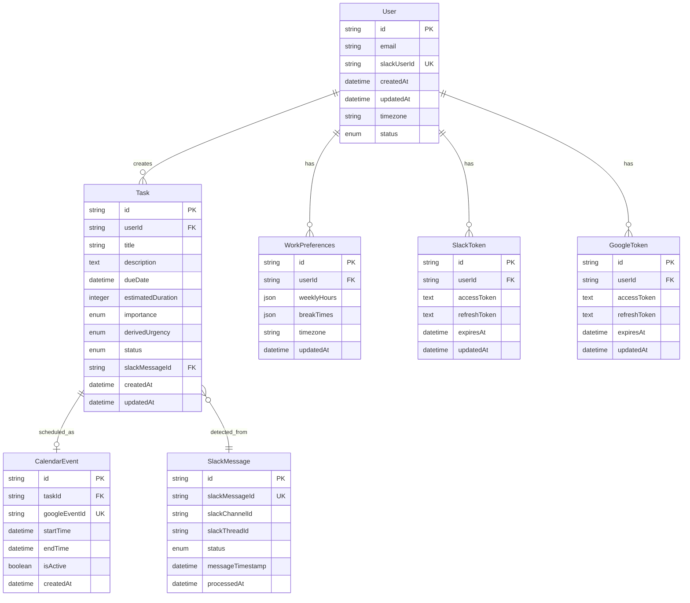

# Data Model: Tandem Slack Bot

**Date**: October 28, 2025  
**Branch**: `001-tandem-slack-bot`

## Entity Relationship Overview



## Entity Definitions

### User
Represents a person using the Tandem system.

**Fields:**
- `id` (UUID, Primary Key): Unique identifier
- `email` (String, Unique): User's email address
- `slackUserId` (String, Unique): Slack user ID for API calls
- `createdAt` (DateTime): Account creation timestamp
- `updatedAt` (DateTime): Last modification timestamp
- `timezone` (String): User's timezone (e.g., "America/New_York")
- `status` (Enum): active | inactive | suspended

**Validation Rules:**
- Email must be valid format
- Slack User ID must be present and unique
- Timezone must be valid IANA timezone string
- Status defaults to 'active'

**Relationships:**
- One-to-many with Tasks
- One-to-one with WorkPreferences
- One-to-one with SlackToken
- One-to-one with GoogleToken

### Task
Represents an action item detected from Slack messages.

**Fields:**
- `id` (UUID, Primary Key): Unique identifier
- `userId` (UUID, Foreign Key): Owner of the task
- `title` (String): Task name/description
- `description` (Text): Detailed task information
- `dueDate` (DateTime): When task must be completed
- `estimatedDuration` (Integer): Duration in minutes
- `importance` (Enum): Low | Medium | High
- `derivedUrgency` (Enum): Low | Medium | High
- `status` (Enum): pending | confirmed | scheduled | completed | dismissed
- `slackMessageId` (UUID, Foreign Key): Source message reference
- `createdAt` (DateTime): Task detection timestamp
- `updatedAt` (DateTime): Last modification timestamp

**Validation Rules:**
- Title must be 1-255 characters
- Due date must be in the future (when created)
- Estimated duration must be 5-480 minutes (8 hours max)
- Derived urgency calculated from due date:
  - High: 0-2 days from now
  - Medium: 3-7 days from now
  - Low: 7+ days from now

**State Transitions:**
- pending → confirmed (user confirms)
- pending → dismissed (user dismisses)
- confirmed → scheduled (calendar event created)
- scheduled → completed (user marks done)
- Any state → dismissed (user can dismiss anytime)

**Relationships:**
- Many-to-one with User
- One-to-one with CalendarEvent (when scheduled)
- Many-to-one with SlackMessage

### CalendarEvent
Represents scheduled time blocks in Google Calendar.

**Fields:**
- `id` (UUID, Primary Key): Unique identifier
- `taskId` (UUID, Foreign Key): Associated task
- `googleEventId` (String, Unique): Google Calendar event ID
- `startTime` (DateTime): Event start time
- `endTime` (DateTime): Event end time
- `isActive` (Boolean): Whether event is still on calendar
- `createdAt` (DateTime): Event creation timestamp

**Validation Rules:**
- Start time must be before end time
- Duration must match task's estimated duration
- Google Event ID must be unique
- IsActive defaults to true

**Relationships:**
- One-to-one with Task

### SlackMessage
Tracks processed Slack messages to prevent duplicates.

**Fields:**
- `id` (UUID, Primary Key): Unique identifier
- `slackMessageId` (String, Unique): Slack's message ID
- `slackChannelId` (String): Channel where message appeared
- `slackThreadId` (String, Nullable): Thread ID if in thread
- `status` (Enum): detected | processed | ignored | error
- `messageTimestamp` (DateTime): When message was sent
- `processedAt` (DateTime): When we processed it

**Validation Rules:**
- Slack message ID must be unique
- Status defaults to 'detected'
- Message timestamp must be valid

**Relationships:**
- One-to-many with Tasks (one message can generate multiple tasks)

### WorkPreferences
User's work schedule and availability settings.

**Fields:**
- `id` (UUID, Primary Key): Unique identifier
- `userId` (UUID, Foreign Key): Associated user
- `weeklyHours` (JSON): Work hours per day of week
- `breakTimes` (JSON): Break periods during work days
- `timezone` (String): User's timezone
- `updatedAt` (DateTime): Last modification timestamp

**JSON Structures:**

`weeklyHours` format:
```json
{
  "monday": {"start": "09:00", "end": "17:00"},
  "tuesday": {"start": "09:00", "end": "17:00"},
  "wednesday": {"start": "09:00", "end": "17:00"},
  "thursday": {"start": "09:00", "end": "17:00"},
  "friday": {"start": "09:00", "end": "17:00"},
  "saturday": null,
  "sunday": null
}
```

`breakTimes` format:
```json
{
  "lunch": {"start": "12:00", "end": "13:00"},
  "morning": {"start": "10:30", "end": "10:45"}
}
```

**Validation Rules:**
- Weekly hours must have valid time format (HH:MM)
- Break times must be within work hours
- Timezone must be valid IANA timezone
- Defaults to 9 AM - 5 PM, Monday-Friday

**Relationships:**
- One-to-one with User

### SlackToken
OAuth tokens for Slack API access.

**Fields:**
- `id` (UUID, Primary Key): Unique identifier
- `userId` (UUID, Foreign Key): Associated user
- `accessToken` (Text, Encrypted): OAuth access token
- `refreshToken` (Text, Encrypted): OAuth refresh token
- `expiresAt` (DateTime): Token expiration time
- `updatedAt` (DateTime): Last token refresh

**Security Rules:**
- Tokens stored encrypted at rest
- Automatic refresh before expiration
- Tokens invalidated on user deactivation

**Relationships:**
- One-to-one with User

### GoogleToken
OAuth tokens for Google Calendar API access.

**Fields:**
- `id` (UUID, Primary Key): Unique identifier
- `userId` (UUID, Foreign Key): Associated user
- `accessToken` (Text, Encrypted): OAuth access token
- `refreshToken` (Text, Encrypted): OAuth refresh token
- `expiresAt` (DateTime): Token expiration time
- `updatedAt` (DateTime): Last token refresh

**Security Rules:**
- Tokens stored encrypted at rest
- Automatic refresh before expiration
- Tokens invalidated on user deactivation

**Relationships:**
- One-to-one with User

## Indexes and Performance

### Primary Indexes
- All primary keys (UUIDs) automatically indexed
- Unique constraints on email, slackUserId, googleEventId, slackMessageId

### Query Optimization Indexes
- `Task.userId, Task.status` (composite) - User's task lists
- `Task.dueDate, Task.status` (composite) - Scheduling queries
- `CalendarEvent.startTime, CalendarEvent.isActive` (composite) - Availability checks
- `SlackMessage.slackMessageId` (unique) - Duplicate detection
- `User.slackUserId` (unique) - Slack webhook lookups

### Background Job Indexes
- `Task.status, Task.createdAt` - Processing queues
- `SlackToken.expiresAt, GoogleToken.expiresAt` - Token refresh jobs

## Database Constraints

### Foreign Key Constraints
- All foreign keys enforce referential integrity
- Cascade delete for dependent records (tokens, preferences)
- Restrict delete for referenced records (users with tasks)

### Check Constraints
- Task.estimatedDuration between 5 and 480 minutes
- All datetime fields must be valid timestamps
- Enum fields must match defined values

### Data Integrity Rules
- User cannot have multiple active tokens of same type
- Calendar events cannot overlap for same user (business logic)
- Task due dates cannot be modified after scheduling (business logic)

## Migration Strategy

### Phase 1: Core Tables
1. Users table with basic authentication
2. SlackTokens and GoogleTokens for OAuth
3. WorkPreferences with default settings

### Phase 2: Task Management
1. SlackMessage tracking table
2. Tasks table with full workflow
3. CalendarEvent integration

### Phase 3: Optimization
1. Add performance indexes
2. Add audit logging
3. Add data retention policies

## Data Retention Policy

### Active Data
- User accounts: Retained while active
- Tasks: Retained for 1 year after completion
- Calendar events: Retained while task exists

### Cleanup Rules
- Dismissed tasks: Deleted after 30 days
- Inactive users: Data exported then deleted after 90 days
- OAuth tokens: Deleted immediately on revocation
- Slack messages: IDs only, no content retention (GDPR compliance)